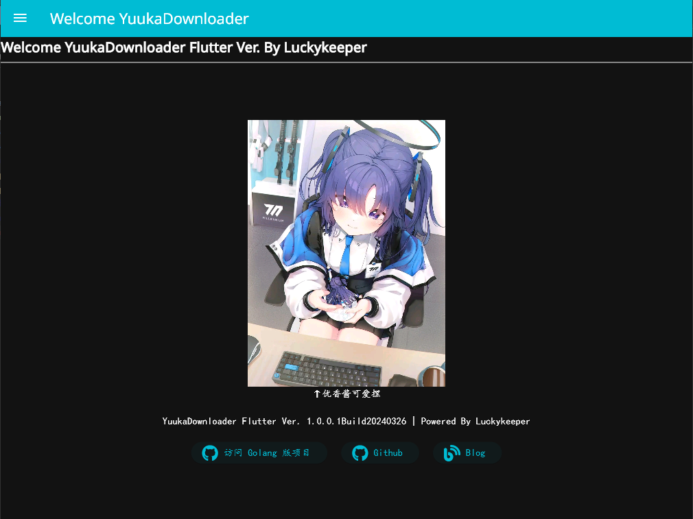
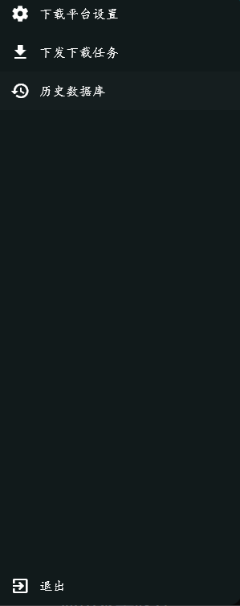
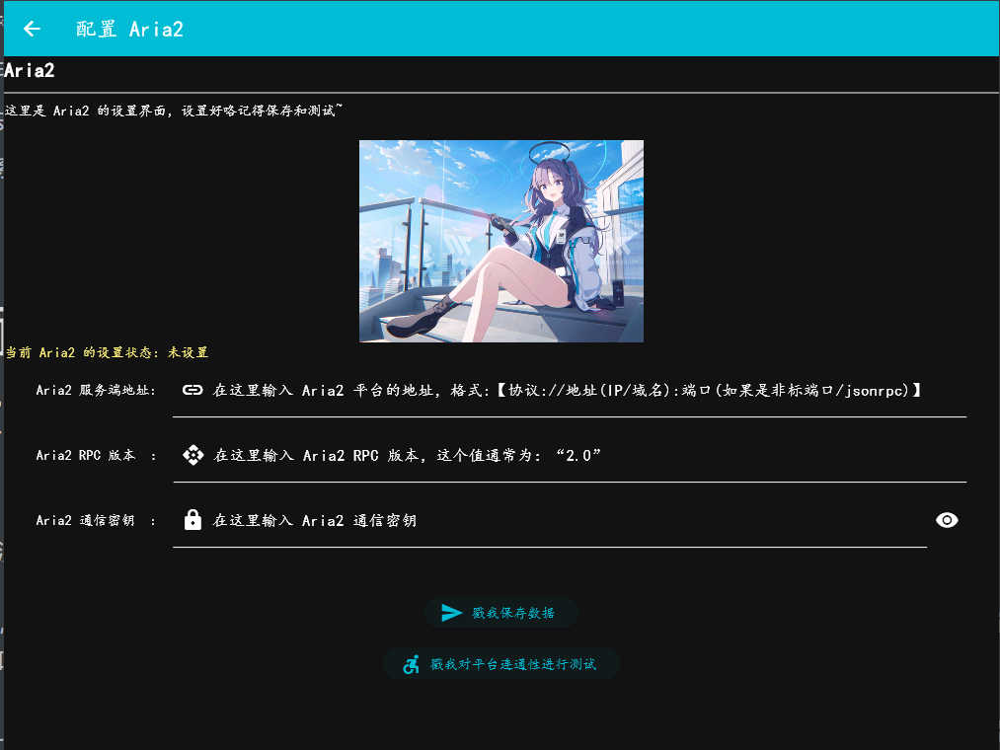
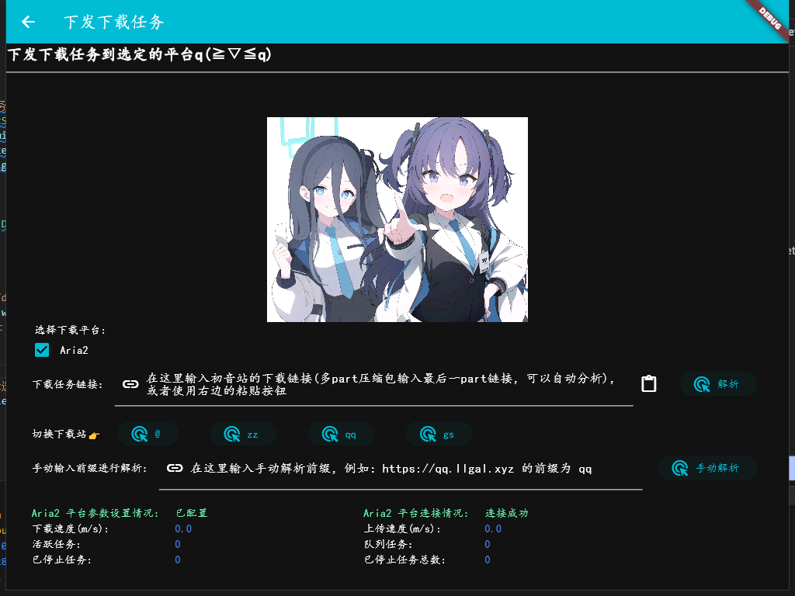
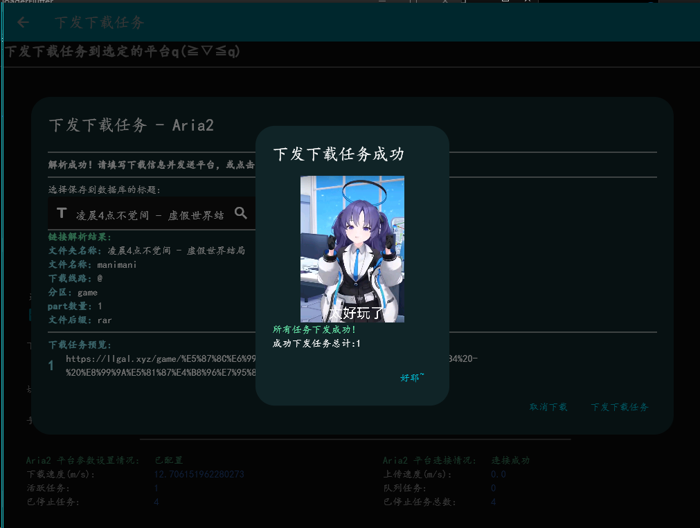
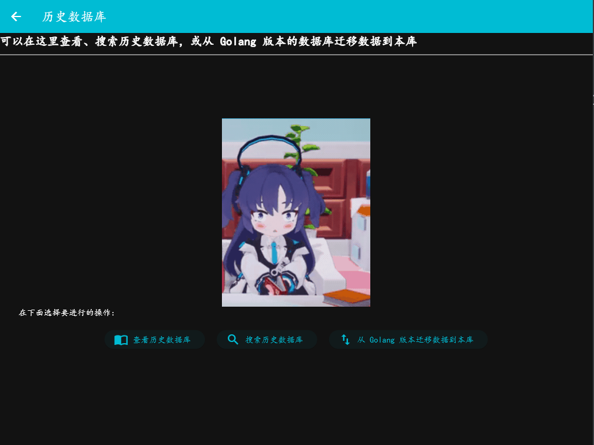
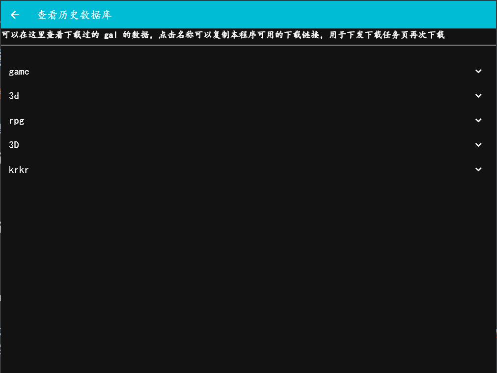
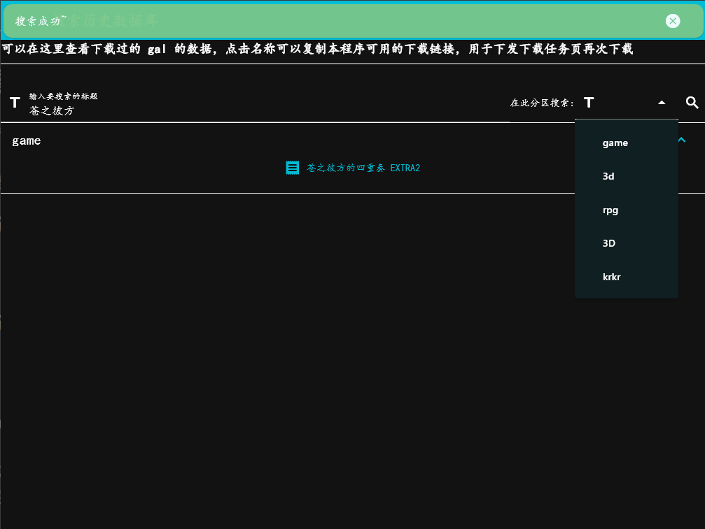
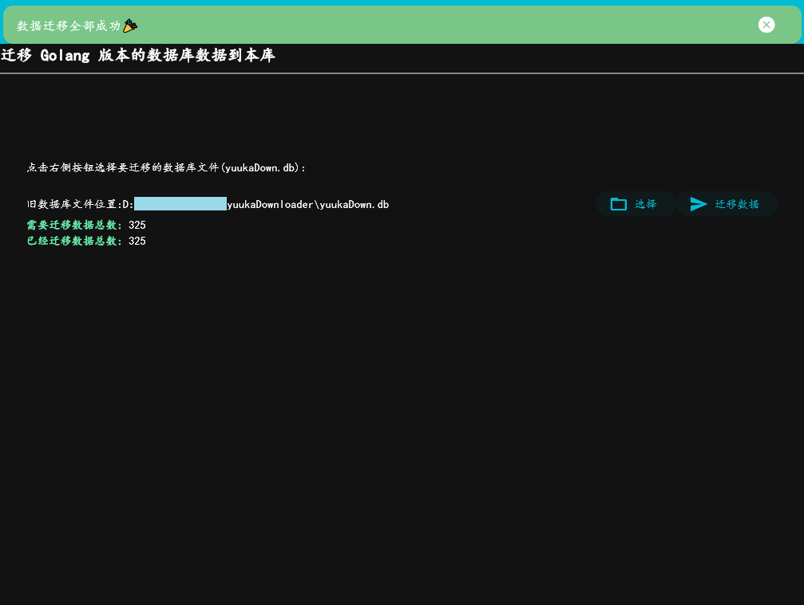

<h1 align="center">YuukaDownloaderFlutter</h1><h4 align="center">优香酱系列小工具 | 快速解析初音站(yngal/fufugal)链接并送Aria2下载</h4>

> 此项目是之前 [luckykeeper/YuukaDownloader](https://github.com/luckykeeper/YuukaDownloader) （原项目是 Golang 开发）的 Flutter 重制版

# 功能简介

- 支持 `Aria2` 平台，下载速度快，部署方便
- 使用单个链接自动推断下载文件名和其余 part 压缩包
- 历史数据库，方便查看下载过的文件，下载链接可导出
- 多系统支持（Windows、Linux、MacOS；其中 MacOS 需要自己打包）

# 界面预览和食用方法

## 首页

   
首页（点击展开/收合图片）
   

首页，没什么好说滴，优香酱可爱捏，软件会自动适配系统主题（我的电脑常开 Dark Mode）

启动时，程序窗口会自动居中并锁定最小大小 1024x768 ，也就是说你的屏幕分辨率需要大于 1024x768，拖动标题可以拖动窗口，双击标题可以最大化窗口

点击左上菜单展开，可以进入下载平台设置、下发下载任务、历史数据库，以及退出按钮，功能和 Golang 版一致

   
菜单（点击展开/收合图片）
   

下载平台设置，和 Golang 版一致，可以对 Aria2 平台的参数进行设置，参数与 Golang 版保持一致，如果你之前使用的是 Golang 版，直接把参数复制过来就 ok 咯~

记得保存参数并进行测试

## 下载平台设置

   
下载平台设置（点击展开/收合图片）
   

下发下载任务模块，和 Golang 版一致，使用粘贴按钮快速粘贴初音站链接（多 part 只需粘贴最后一 part 即可），程序会自动解析其它 part

使用“切换下载站”功能可快速在各个下载站间切换，对于没有提供的下载站可手动在输入框输入并手动解析

同时下面显示了 Aria2 平台当前的状态

## 下发下载任务

   
下发下载任务详情（点击展开/收合图片）
   

点击解析后出现如下页面，选择保存名称后点击“下发任务”即可送下载

   
下发下载任务详情（点击展开/收合图片）
   

## 历史数据库

有三个模块，查看，搜索历史数据库，以及从 Golang 版本迁移数据

   
历史数据库（点击展开/收合图片）
   

### 查看历史数据库

按照分区显示，展开分区显示游戏名称，点击可复制链接，送“下发下载任务”即可再次下载，也可用于浏览器粘贴下载

   
查看历史数据库（点击展开/收合图片）
   

### 搜索历史数据库

和查看界面差不多，但是可以搜索，分区可以选择也可以不选，根据搜索条件搜索已经下载过的游戏，点击可复制链接，送“下发下载任务”即可再次下载，也可用于浏览器粘贴下载

   
搜索历史数据库（点击展开/收合图片）
   

### 从 Golang 版本迁移数据

如果你之前使用的是 Golang 版本的 YuukaDownloader ，你可以把它的数据迁移过来，（建议把 YuukaDownloader 运行目录下的 SQLite 数据库文件 `yuukaDown.db` 复制到本程序的运行目录），然后点击迁移数据即可，迁移数据方向是 Golang 版-> Flutter 版，不能反向迁移，还请注意

   
迁移数据（点击展开/收合图片）
   

# 版本升级注意事项

遇到新版发布，在下载新版之后，把旧版文件夹的 `yuukaDownloader.realm` 和 `yuukaDownloader.realm.lock` 数据库文件复制过去即可

# 优香酱系列小工具导航

- GitHub - luckykeeper/RESTCONF-YuukaChan: 优香酱华为 USG 系列设备北向管理小工具 | HayaseYuuka Huawei USG Series Device RESTCONF Management Tool
  https://github.com/luckykeeper/RESTCONF-YuukaChan
- GitHub - luckykeeper/YuukaChan-DPTECH: 优香酱迪普 FW 系列设备管理小工具 | HayaseYuuka DPTech FW Series Device Management Tool
  https://github.com/luckykeeper/YuukaChan-DPTECH
- GitHub - luckykeeper/YuukaDownloader: （Golang 版）优香酱系列小工具——快速解析初音站(yngal/fufugal)链接并送Aria2下载
  https://github.com/luckykeeper/YuukaDownloader
- GitHub - luckykeeper/yuuka_downloader_flutter: (Flutter 版)优香酱系列小工具——快速解析初音站(yngal/fufugal)链接并送Aria2下载 [https://github.com/luckykeeper/yuuka_downloader_flutter](https://github.com/luckykeeper/yuuka_downloader_flutter)
- GitHub - luckykeeper/YuukaChan-Ruijie-WS6xxx-Exporter: 优香酱系列小工具——锐捷AC WS6xxx 系列 Prometheus Exporter ，附带 Grafana 仪表盘模板 | HayaseYuuka Ruijie AC WS6xxx Series Prometheus Exporter With Grafana Template Included https://github.com/luckykeeper/YuukaChan-Ruijie-WS6xxx-Exporter

# 💈就要在这里立法典！

嘿嘿 优香 嘿嘿

对于体操服优香，我的评价是四个字：好有感觉。我主要想注重于两点，来阐述我对于体操服优香的拙见：第一，我非常喜欢优香。优香的立绘虽然把优香作为好母亲的一面展现了出来（安产型的臀部）。但是她这个头发，尤其是双马尾，看起来有点奇怪。但是这个羁绊剧情里的优香，马尾非常的自然，看上去比较长，真的好棒，好有感觉。这个泛红的脸颊，迷离的眼神，和这个袖口与手套之间露出的白皙手腕，我就不多说了。第二，我非常喜欢体操服。这是在很久很久之前，在认识优香之前，完完全全的xp使然。然而优香她不仅穿体操服，她还扎单马尾，她还穿外套，她竟然还不好好穿外套，她甚至在脸上贴星星（真的好可爱）。（倒吸一口凉气）我的妈呀，这已经到了仅仅是看一眼都能让人癫狂的程度。然而体操服优香并不实装，她真的只是给你看一眼，哈哈。与其说体操服优香让我很有感觉，不如说体操服优香就是为了我的xp量身定做的。抛开这一切因素，只看性格，优香也是数一数二的好女孩：公私分明，精明能干;但是遇到不擅长的事情也会变得呆呆的。我想和优香一起养一个爱丽丝当女儿，所以想在这里问一下大家，要买怎样的枕头才能做这样的梦呢？优香是越看越可爱的，大家可以不必拘束于这机会上的小粗腿优香，大胆的发现这个又呆又努力的女孩真正的可爱之处。

